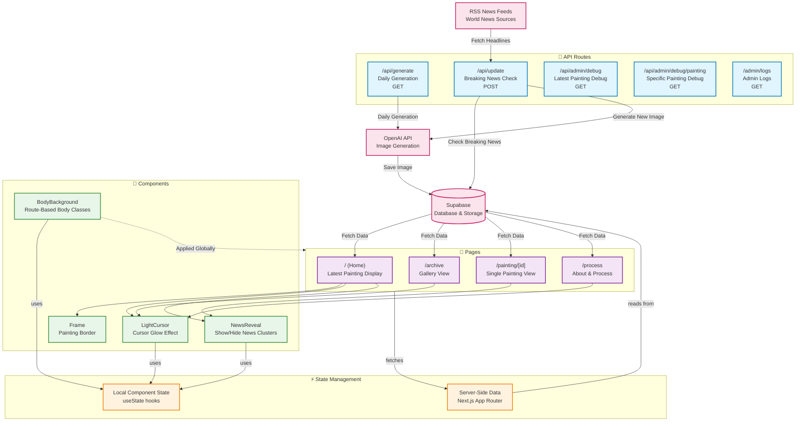

# World News Painting - Architecture Diagram

## Key Architecture Points

### Pages & Routes
- **Home (`/`)**: Displays the latest generated painting with news clusters
- **Archive (`/archive`)**: Grid gallery of historical paintings
- **Painting Detail (`/painting/[id]`)**: Individual painting view with full details
- **Process (`/process`)**: About page showing development history

### Components
- **Frame**: Decorative border wrapper for paintings (used on home page)
- **LightCursor**: Interactive cursor glow effect (used on home, archive, process)
- **NewsReveal**: Collapsible component to show/hide news cluster titles
- **BodyBackground**: Manages route-specific body classes for styling

### API Endpoints
- **`/api/generate`**: Daily scheduled generation (via cron)
- **`/api/update`**: Breaking news check (runs every 120 minutes)
- **`/api/admin/debug`**: Admin tools for debugging latest painting
- **`/api/admin/debug/painting`**: Admin tools for specific painting queries
- **`/admin/logs`**: Admin log viewer

### State Management
- **Local Component State**: Uses React's `useState` for UI interactions (cursor position, reveal toggle, body classes)
- **Server-Side State**: Next.js App Router fetches data server-side from Supabase on page load
- **No Global State Library**: Pure React hooks + server-side data fetching

### Data Flow
1. **News Collection**: RSS feeds → News API → Breaking news detection
2. **Image Generation**: OpenAI API → Generated images → Supabase Storage
3. **Page Rendering**: Supabase → Server-side fetch → Pages → Components

